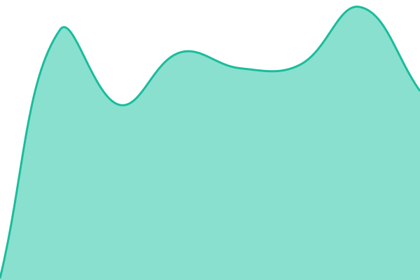

# [📈 Live Status](https://waja.github.io/cyconet-upptime): <!--live status--> **🟧 Partial outage**

This repository contains the open-source uptime monitor and status page for [waja](http://log.c5t.org/about/), powered by [Upptime](https://github.com/upptime/upptime).

With [Upptime](https://upptime.js.org), you can get your own unlimited and free uptime monitor and status page, powered entirely by a GitHub repository. We use [Issues](https://github.com/waja/cyconet-upptime/issues) as incident reports, [Actions](https://github.com/waja/cyconet-upptime/actions) as uptime monitors, and [Pages](https://waja.github.io/cyconet-upptime) for the status page.

<!--start: status pages-->
<!-- This summary is generated by Upptime (https://github.com/upptime/upptime) -->
<!-- Do not edit this manually, your changes will be overwritten -->
<!-- prettier-ignore -->
| URL | Status | History | Response Time | Uptime |
| --- | ------ | ------- | ------------- | ------ |
|  [cyconet.org](https://www.cyconet.org) | 🟥 Down | [cyconet-org.yml](https://github.com/waja/cyconet-upptime/commits/HEAD/history/cyconet-org.yml) | 

 594ms
     
 | 

<a href="https://waja.github.io/cyconet-upptime/history/cyconet-org">86.12%</a>
    

|  [cyconet.org Blog](https://log.cyconet.org) | 🟩 Up | [cyconet-org-blog.yml](https://github.com/waja/cyconet-upptime/commits/HEAD/history/cyconet-org-blog.yml) | 

 835ms
     
 | 

<a href="https://waja.github.io/cyconet-upptime/history/cyconet-org-blog">90.89%</a>
    

|  1st Nameserver | 🟩 Up | [1st-nameserver.yml](https://github.com/waja/cyconet-upptime/commits/HEAD/history/1st-nameserver.yml) | 

 129ms
     
 | 

<a href="https://waja.github.io/cyconet-upptime/history/1st-nameserver">100.00%</a>
    

|  2nd Nameserver | 🟩 Up | [2nd-nameserver.yml](https://github.com/waja/cyconet-upptime/commits/HEAD/history/2nd-nameserver.yml) | 

 105ms
     
 | 

<a href="https://waja.github.io/cyconet-upptime/history/2nd-nameserver">100.00%</a>
    

|  Container platform | 🟩 Up | [container-platform.yml](https://github.com/waja/cyconet-upptime/commits/HEAD/history/container-platform.yml) | 

 128ms
     
 | 

<a href="https://waja.github.io/cyconet-upptime/history/container-platform">100.00%</a>
    

|  Traefik router | 🟩 Up | [traefik-router.yml](https://github.com/waja/cyconet-upptime/commits/HEAD/history/traefik-router.yml) | 

 531ms
     
 | 

<a href="https://waja.github.io/cyconet-upptime/history/traefik-router">100.00%</a>
    

|  Mail SMTP | 🟩 Up | [mail-smtp.yml](https://github.com/waja/cyconet-upptime/commits/HEAD/history/mail-smtp.yml) | 

 129ms
     
 | 

<a href="https://waja.github.io/cyconet-upptime/history/mail-smtp">100.00%</a>
    

|  Mail IMAP | 🟩 Up | [mail-imap.yml](https://github.com/waja/cyconet-upptime/commits/HEAD/history/mail-imap.yml) | 

 128ms
     
 | 

<a href="https://waja.github.io/cyconet-upptime/history/mail-imap">100.00%</a>
    

|  Mail SUBMISSION | 🟩 Up | [mail-submission.yml](https://github.com/waja/cyconet-upptime/commits/HEAD/history/mail-submission.yml) | 

 128ms
     
 | 

<a href="https://waja.github.io/cyconet-upptime/history/mail-submission">100.00%</a>
    

|  Monitoring platform | 🟥 Down | [monitoring-platform.yml](https://github.com/waja/cyconet-upptime/commits/HEAD/history/monitoring-platform.yml) | 

 385ms
     
 | 

<a href="https://waja.github.io/cyconet-upptime/history/monitoring-platform">100.00%</a>
    

|  Nextcloud platform | 🟩 Up | [nextcloud-platform.yml](https://github.com/waja/cyconet-upptime/commits/HEAD/history/nextcloud-platform.yml) | 

 1310ms
     
 | 

<a href="https://waja.github.io/cyconet-upptime/history/nextcloud-platform">100.00%</a>
    

|  Metrics platform | 🟩 Up | [metrics-platform.yml](https://github.com/waja/cyconet-upptime/commits/HEAD/history/metrics-platform.yml) | 

 1276ms
     
 | 

<a href="https://waja.github.io/cyconet-upptime/history/metrics-platform">100.00%</a>
    

|  Portainer platform | 🟩 Up | [portainer-platform.yml](https://github.com/waja/cyconet-upptime/commits/HEAD/history/portainer-platform.yml) | 

 521ms
     
 | 

<a href="https://waja.github.io/cyconet-upptime/history/portainer-platform">100.00%</a>
    

|  Paste system | 🟥 Down | [paste-system.yml](https://github.com/waja/cyconet-upptime/commits/HEAD/history/paste-system.yml) | 

 0ms
     
 | 

<a href="https://waja.github.io/cyconet-upptime/history/paste-system">0.00%</a>
    

|  FTP repository archive | 🟩 Up | [ftp-repository-archive.yml](https://github.com/waja/cyconet-upptime/commits/HEAD/history/ftp-repository-archive.yml) | 

 544ms
     
 | 

<a href="https://waja.github.io/cyconet-upptime/history/ftp-repository-archive">92.77%</a>
    

|  Gitlab | 🟩 Up | [gitlab.yml](https://github.com/waja/cyconet-upptime/commits/HEAD/history/gitlab.yml) | 

 1332ms
     
 | 

<a href="https://waja.github.io/cyconet-upptime/history/gitlab">100.00%</a>
    

|  Development infrastructure | 🟩 Up | [development-infrastructure.yml](https://github.com/waja/cyconet-upptime/commits/HEAD/history/development-infrastructure.yml) | 

 129ms
     
 | 

<a href="https://waja.github.io/cyconet-upptime/history/development-infrastructure">100.00%</a>
    

|  Shared hosting | 🟥 Down | [shared-hosting.yml](https://github.com/waja/cyconet-upptime/commits/HEAD/history/shared-hosting.yml) | 

 0ms
     
 | 

<a href="https://waja.github.io/cyconet-upptime/history/shared-hosting">100.00%</a>
    

|  Homeoffice 1 | 🟩 Up | [homeoffice-1.yml](https://github.com/waja/cyconet-upptime/commits/HEAD/history/homeoffice-1.yml) | 

 131ms
     
 | 

<a href="https://waja.github.io/cyconet-upptime/history/homeoffice-1">43.19%</a>
    

|  Oracle Cloud 31 (Alma Linux 9) | 🟥 Down | [oracle-cloud-31-alma-linux-9.yml](https://github.com/waja/cyconet-upptime/commits/HEAD/history/oracle-cloud-31-alma-linux-9.yml) | 

 0ms
     
 | 

<a href="https://waja.github.io/cyconet-upptime/history/oracle-cloud-31-alma-linux-9">0.00%</a>
    

|  Oracle Cloud 32 (Ubuntu 22.04 LTS) | 🟩 Up | [oracle-cloud-32-ubuntu-22-04-lts.yml](https://github.com/waja/cyconet-upptime/commits/HEAD/history/oracle-cloud-32-ubuntu-22-04-lts.yml) | 

 117ms
     
 | 

<a href="https://waja.github.io/cyconet-upptime/history/oracle-cloud-32-ubuntu-22-04-lts">100.00%</a>
    

|  Oracle Cloud 33 (Oracle Linux 8) | 🟥 Down | [oracle-cloud-33-oracle-linux-8.yml](https://github.com/waja/cyconet-upptime/commits/HEAD/history/oracle-cloud-33-oracle-linux-8.yml) | 

 116ms
     
 | 

<a href="https://waja.github.io/cyconet-upptime/history/oracle-cloud-33-oracle-linux-8">84.19%</a>
    

|  Oracle Cloud 34 (Ubuntu 22.04 LTS - arm64) | 🟥 Down | [oracle-cloud-34-ubuntu-22-04-lts-arm64.yml](https://github.com/waja/cyconet-upptime/commits/HEAD/history/oracle-cloud-34-ubuntu-22-04-lts-arm64.yml) | 

 112ms
     
 | 

<a href="https://waja.github.io/cyconet-upptime/history/oracle-cloud-34-ubuntu-22-04-lts-arm64">85.37%</a>
    

<!--end: status pages-->

[**Visit our status website →**](https://waja.github.io/cyconet-upptime)

## 📄 License

- Powered by: [Upptime](https://github.com/upptime/upptime)
- Code: [MIT](./LICENSE) © [waja](http://log.c5t.org/about/)
- Data in the `./history` directory: [Open Database License](https://opendatacommons.org/licenses/odbl/1-0/)
