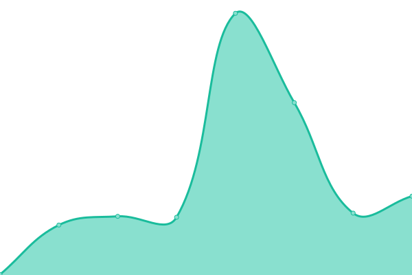

# [📈 Live Status](https://waja.github.io/cyconet-upptime): <!--live status--> **🟧 Partial outage**

This repository contains the open-source uptime monitor and status page for [waja](http://log.c5t.org/about/), powered by [Upptime](https://github.com/upptime/upptime).

With [Upptime](https://upptime.js.org), you can get your own unlimited and free uptime monitor and status page, powered entirely by a GitHub repository. We use [Issues](https://github.com/waja/cyconet-upptime/issues) as incident reports, [Actions](https://github.com/waja/cyconet-upptime/actions) as uptime monitors, and [Pages](https://waja.github.io/cyconet-upptime) for the status page.

<!--start: status pages-->
<!-- This summary is generated by Upptime (https://github.com/upptime/upptime) -->
<!-- Do not edit this manually, your changes will be overwritten -->
<!-- prettier-ignore -->
| URL | Status | History | Response Time | Uptime |
| --- | ------ | ------- | ------------- | ------ |
|  [cyconet.org](https://www.cyconet.org) | 🟩 Up | [cyconet-org.yml](https://github.com/waja/cyconet-upptime/commits/HEAD/history/cyconet-org.yml) | 

 727ms
     
 | 

<a href="https://waja.github.io/cyconet-upptime/history/cyconet-org">100.00%</a>
    

|  [cyconet.org Blog](https://log.cyconet.org) | 🟩 Up | [cyconet-org-blog.yml](https://github.com/waja/cyconet-upptime/commits/HEAD/history/cyconet-org-blog.yml) | 

 1091ms
     
 | 

<a href="https://waja.github.io/cyconet-upptime/history/cyconet-org-blog">100.00%</a>
    

|  1st Nameserver | 🟩 Up | [1st-nameserver.yml](https://github.com/waja/cyconet-upptime/commits/HEAD/history/1st-nameserver.yml) | 

 160ms
     
 | 

<a href="https://waja.github.io/cyconet-upptime/history/1st-nameserver">100.00%</a>
    

|  2nd Nameserver | 🟩 Up | [2nd-nameserver.yml](https://github.com/waja/cyconet-upptime/commits/HEAD/history/2nd-nameserver.yml) | 

 162ms
     
 | 

<a href="https://waja.github.io/cyconet-upptime/history/2nd-nameserver">100.00%</a>
    

|  Cloud platform | 🟥 Down | [cloud-platform.yml](https://github.com/waja/cyconet-upptime/commits/HEAD/history/cloud-platform.yml) | 

 0ms
     
 | 

<a href="https://waja.github.io/cyconet-upptime/history/cloud-platform">0.00%</a>
    

|  Container platform | 🟩 Up | [container-platform.yml](https://github.com/waja/cyconet-upptime/commits/HEAD/history/container-platform.yml) | 

 145ms
     
 | 

<a href="https://waja.github.io/cyconet-upptime/history/container-platform">100.00%</a>
    

|  Traefik router | 🟩 Up | [traefik-router.yml](https://github.com/waja/cyconet-upptime/commits/HEAD/history/traefik-router.yml) | 

 497ms
     
 | 

<a href="https://waja.github.io/cyconet-upptime/history/traefik-router">100.00%</a>
    

|  Mail SMTP | 🟥 Down | [mail-smtp.yml](https://github.com/waja/cyconet-upptime/commits/HEAD/history/mail-smtp.yml) | 

 0ms
     
 | 

<a href="https://waja.github.io/cyconet-upptime/history/mail-smtp">0.00%</a>
    

|  Mail IMAP | 🟥 Down | [mail-imap.yml](https://github.com/waja/cyconet-upptime/commits/HEAD/history/mail-imap.yml) | 

 0ms
     
 | 

<a href="https://waja.github.io/cyconet-upptime/history/mail-imap">0.00%</a>
    

|  Mail SUBMISSION | 🟥 Down | [mail-submission.yml](https://github.com/waja/cyconet-upptime/commits/HEAD/history/mail-submission.yml) | 

 0ms
     
 | 

<a href="https://waja.github.io/cyconet-upptime/history/mail-submission">0.00%</a>
    

|  Monitoring platform | 🟩 Up | [monitoring-platform.yml](https://github.com/waja/cyconet-upptime/commits/HEAD/history/monitoring-platform.yml) | 

 625ms
     
 | 

<a href="https://waja.github.io/cyconet-upptime/history/monitoring-platform">100.00%</a>
    

|  Nextcloud platform | 🟩 Up | [nextcloud-platform.yml](https://github.com/waja/cyconet-upptime/commits/HEAD/history/nextcloud-platform.yml) | 

 980ms
     
 | 

<a href="https://waja.github.io/cyconet-upptime/history/nextcloud-platform">100.00%</a>
    

|  Metrics platform | 🟩 Up | [metrics-platform.yml](https://github.com/waja/cyconet-upptime/commits/HEAD/history/metrics-platform.yml) | 

 1110ms
     
 | 

<a href="https://waja.github.io/cyconet-upptime/history/metrics-platform">100.00%</a>
    

|  Portainer platform | 🟩 Up | [portainer-platform.yml](https://github.com/waja/cyconet-upptime/commits/HEAD/history/portainer-platform.yml) | 

 168ms
     
 | 

<a href="https://waja.github.io/cyconet-upptime/history/portainer-platform">100.00%</a>
    

|  Paste system | 🟩 Up | [paste-system.yml](https://github.com/waja/cyconet-upptime/commits/HEAD/history/paste-system.yml) | 

 701ms
     
 | 

<a href="https://waja.github.io/cyconet-upptime/history/paste-system">100.00%</a>
    

|  FTP repository archive | 🟩 Up | [ftp-repository-archive.yml](https://github.com/waja/cyconet-upptime/commits/HEAD/history/ftp-repository-archive.yml) | 

 603ms
     
 | 

<a href="https://waja.github.io/cyconet-upptime/history/ftp-repository-archive">100.00%</a>
    

|  Gitlab | 🟩 Up | [gitlab.yml](https://github.com/waja/cyconet-upptime/commits/HEAD/history/gitlab.yml) | 

 1362ms
     
 | 

<a href="https://waja.github.io/cyconet-upptime/history/gitlab">100.00%</a>
    

|  Development infrastructure | 🟩 Up | [development-infrastructure.yml](https://github.com/waja/cyconet-upptime/commits/HEAD/history/development-infrastructure.yml) | 

 146ms
     
 | 

<a href="https://waja.github.io/cyconet-upptime/history/development-infrastructure">100.00%</a>
    

|  Shared hosting | 🟥 Down | [shared-hosting.yml](https://github.com/waja/cyconet-upptime/commits/HEAD/history/shared-hosting.yml) | 

 876ms
     
 | 

<a href="https://waja.github.io/cyconet-upptime/history/shared-hosting">40.61%</a>
    

|  Homeoffice 1 | 🟩 Up | [homeoffice-1.yml](https://github.com/waja/cyconet-upptime/commits/HEAD/history/homeoffice-1.yml) | 

 183ms
     
 | 

<a href="https://waja.github.io/cyconet-upptime/history/homeoffice-1">100.00%</a>
    

|  Cloud at Cost 01 (Debian 10) | 🟩 Up | [cloud-at-cost-01-debian-10.yml](https://github.com/waja/cyconet-upptime/commits/HEAD/history/cloud-at-cost-01-debian-10.yml) | 

 91ms
     
 | 

<a href="https://waja.github.io/cyconet-upptime/history/cloud-at-cost-01-debian-10">100.00%</a>
    

|  Cloud at Cost 02 (Debian 10) | 🟩 Up | [cloud-at-cost-02-debian-10.yml](https://github.com/waja/cyconet-upptime/commits/HEAD/history/cloud-at-cost-02-debian-10.yml) | 

 89ms
     
 | 

<a href="https://waja.github.io/cyconet-upptime/history/cloud-at-cost-02-debian-10">100.00%</a>
    

|  Cloud at Cost 03 (Debian 10) | 🟥 Down | [cloud-at-cost-03-debian-10.yml](https://github.com/waja/cyconet-upptime/commits/HEAD/history/cloud-at-cost-03-debian-10.yml) | 

 0ms
     
 | 

<a href="https://waja.github.io/cyconet-upptime/history/cloud-at-cost-03-debian-10">8.91%</a>
    

|  Cloud at Cost 04 (Debian 11) | 🟩 Up | [cloud-at-cost-04-debian-11.yml](https://github.com/waja/cyconet-upptime/commits/HEAD/history/cloud-at-cost-04-debian-11.yml) | 

 85ms
     
 | 

<a href="https://waja.github.io/cyconet-upptime/history/cloud-at-cost-04-debian-11">100.00%</a>
    

|  Cloud at Cost 11 (Ubuntu 20.04 LTS) | 🟩 Up | [cloud-at-cost-11-ubuntu-20-04-lts.yml](https://github.com/waja/cyconet-upptime/commits/HEAD/history/cloud-at-cost-11-ubuntu-20-04-lts.yml) | 

 84ms
     
 | 

<a href="https://waja.github.io/cyconet-upptime/history/cloud-at-cost-11-ubuntu-20-04-lts">100.00%</a>
    

|  Cloud at Cost 21 (Ubuntu 20.04 LTS) | 🟩 Up | [cloud-at-cost-21-ubuntu-20-04-lts.yml](https://github.com/waja/cyconet-upptime/commits/HEAD/history/cloud-at-cost-21-ubuntu-20-04-lts.yml) | 

 84ms
     
 | 

<a href="https://waja.github.io/cyconet-upptime/history/cloud-at-cost-21-ubuntu-20-04-lts">100.00%</a>
    

|  Cloud at Cost 22 (CentOS 8) | 🟩 Up | [cloud-at-cost-22-cent-os-8.yml](https://github.com/waja/cyconet-upptime/commits/HEAD/history/cloud-at-cost-22-cent-os-8.yml) | 

 88ms
     
 | 

<a href="https://waja.github.io/cyconet-upptime/history/cloud-at-cost-22-cent-os-8">100.00%</a>
    

|  Oracle Cloud 31 (Oracle Linux 8) | 🟩 Up | [oracle-cloud-31-oracle-linux-8.yml](https://github.com/waja/cyconet-upptime/commits/HEAD/history/oracle-cloud-31-oracle-linux-8.yml) | 

 173ms
     
 | 

<a href="https://waja.github.io/cyconet-upptime/history/oracle-cloud-31-oracle-linux-8">100.00%</a>
    

|  Oracle Cloud 32 (Ubuntu 20.04 LTS) | 🟩 Up | [oracle-cloud-32-ubuntu-20-04-lts.yml](https://github.com/waja/cyconet-upptime/commits/HEAD/history/oracle-cloud-32-ubuntu-20-04-lts.yml) | 

 173ms
     
 | 

<a href="https://waja.github.io/cyconet-upptime/history/oracle-cloud-32-ubuntu-20-04-lts">100.00%</a>
    

<!--end: status pages-->

[**Visit our status website →**](https://waja.github.io/cyconet-upptime)

## 📄 License

- Powered by: [Upptime](https://github.com/upptime/upptime)
- Code: [MIT](./LICENSE) © [waja](http://log.c5t.org/about/)
- Data in the `./history` directory: [Open Database License](https://opendatacommons.org/licenses/odbl/1-0/)
